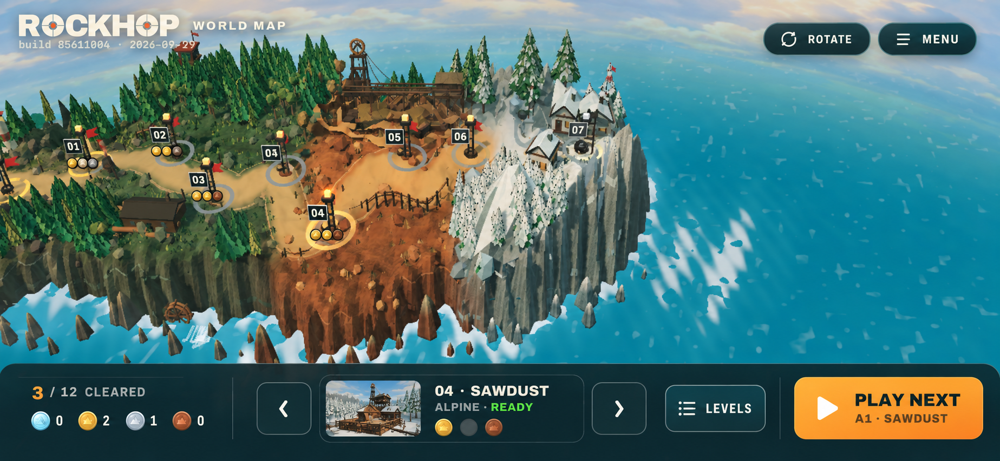
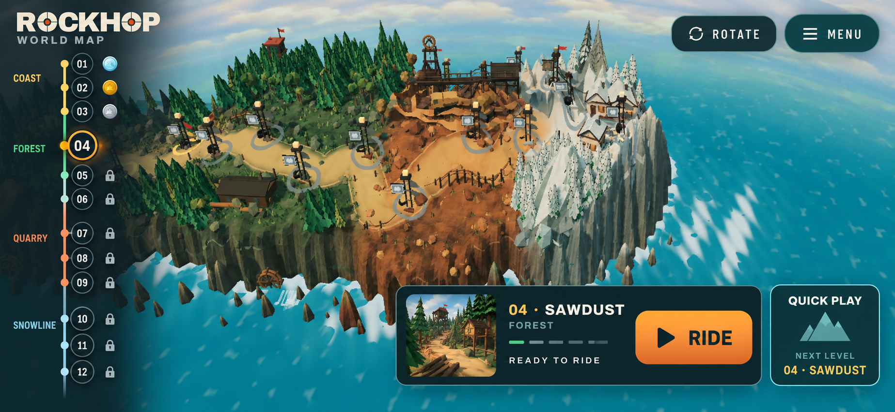
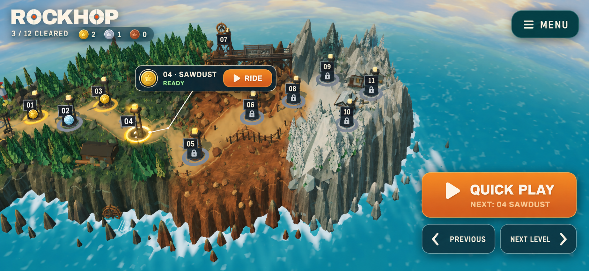

# 3D world map + level selector — three HUD directions

These are **visual studies**, generated from the current played C-island screenshot. They are not screenshots of implemented UI. Judge the control layout and visibility of the island; generated tower numbers, medal colors, and labels are illustrative. The game must read the actual twelve-course save state and use **Coast → Alpine → Quarry → Snowline** (the B mockup says “Forest” in one place; that is not game data).

## A — Campaign command strip

One persistent bottom strip combines medal progress, previous/next stage selection, selected-course context, and a large **Play Next** button. The fast path is one tap after opening the map. Strongest immediate usability, but the strip takes more vertical scenery on short phones. The extra “Levels” button is optional because the strip already browses stages.

## B — Route ribbon

A numbered twelve-stop rail makes the entire campaign order and locks explicit; a selected-course card contains **Ride**, while **Quick Play** skips selection. Strongest at-a-glance course access, but the permanent left rail and lower card cover the most 3D map. On a 390-point-high phone the rail should scroll in one axis with 44-point targets, not shrink all twelve rows below touch size.

## C — Map compass

A floating selected-tower card and a right-thumb cluster keep the island largest. **Quick Play** launches the recommended next course; **Previous / Next Level** move the focus, and **Ride** starts the selected course. Strongest relationship between a 3D tower and its action, but the floating card must avoid occluding its own tower and re-anchor as the camera moves. Add the existing Rotate affordance in implementation; the concept image omits it.

## Decision and implementation bar

**Recommendation:** A is the clearest first ship direction for a one-tap return to riding. C is the most map-like visual direction, and its tower callout could be paired with a smaller version of A's strip. B is best only if seeing all twelve slots at once is the priority.

**Selected by the user:** A, the campaign command strip. Build its HUD against the actual 3D selector and saved campaign data. The mockup's little terrain thumbnail and per-tower medal stack are illustrative; the implementation may use a small scene-backed preview and authentic medal state without adding new downloaded art.

Whichever direction is selected: opening the map shows the correct recommended course; its primary action starts that course in one tap without a flag selection; previous/next selection is available by touch and keyboard/gamepad; a locked course never launches; medals, lock rules, and course names come from the save; default drag remains pan, Rotate remains explicit, and portrait shows the existing landscape prompt. Verify at 852×393 and a smaller landscape phone size with a played Menu → Map → Ride clip, exact course ID, saved-state reentry, and the existing crash/restart gate.

**Source:** `docs/evidence/world-map-pan-focus/landscape-panned.png` (actual headless played map). Generated as three separate built-in imagegen UI mockups using that screenshot as the edit target, preserving the island's visual character while exploring different UI overlays. These images are design references only, not production assets.
