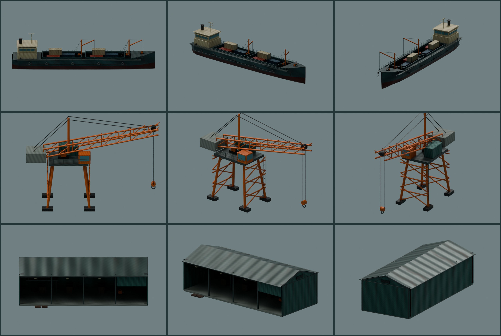
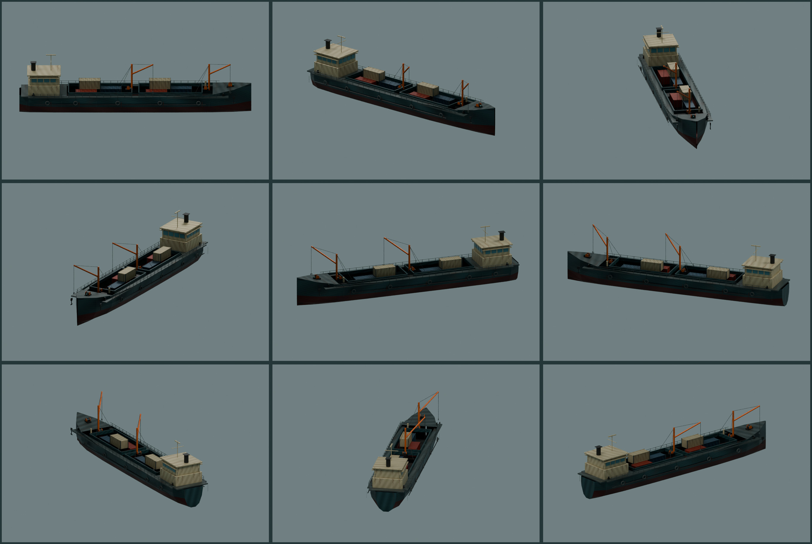

# Coast harbor authored family — offline candidate

**Not integrated, not accepted as a course remaster.** These are offline model source boards. Only the parent can judge matched moving C1 full-ride/fault/restart views after integrating the candidate. The rejected Coast standard remains rejected.

## References and modeled response

Inspected played `/tmp/rockhop-coast-motion/before-03.jpg` and `after-{01,03,05,06,08}.jpg`: the original reads as a layered, active terminal with corrugated sheds, cargo rows, freighters and cranes; the rejected candidate leaves empty sea behind a sterile pale shed and shallow ship slabs. Source inspection used the nine-view and nine-angle boards below. No browser, shared build or live renderer hook was run.

This replacement authors three-dimensional freighter holds/bridge/rigging, a crane with depth, a pile-supported loading terminal and an open stocked warehouse. The source deliberately retains the existing dimensional C1 tug and the brake/landing's dedicated dock machinery. Primary shapes and manufacture carry detail; textures supply wear and surface response.

The source board is **not** production fog, course lighting or device evidence. It exposed and helped repair a UV-layer naming mismatch that initially made bridge/cargo regions sample the hull tile. Source board interiors remain dark; loading-bay readability in game still needs judgment.

## Exact authoring exports

All five runtime candidate files are retained in isolated `assets/blender/course-kits/coast-harbor/delivery/`, byte-checked against ignored authoring output during cleanup. No public bytes are staged. `export-manifest.json` records their complete immutable SHA-256 values and per-prototype bounds.

| Export | Bytes | Triangles / bank draws | SHA-256 |
| --- | ---: | --- | --- |
| coast-harbor.glb | 833,348 | 45,576 / 14 | 3c9fcaf62d1355c68af48662f9198822cde53db41f5d39e210db7c2abf8db62b |
| coast-harbor-lod.glb | 328,996 | 16,456 / 14 | 12f10c88716765b2e31518fff246e0f66ad59b68aa64974907da3a9a81bf3fc7 |
| coast-albedo.phone.webp | 192,204 | 512² | 6bbbef3e1273787587cffd4e0f2b4e8fdf1f173e4a22b2d9296e0fe0d544dec8 |
| coast-normal.phone.webp | 20,342 | 512² | 4f83c0f35100efbf803beee630c7f39fab33864e1b7d73a682c547f619817bbb |
| coast-arm.phone.webp | 9,758 | 512² | 7ef8ea04566fef194cf5104041461ca890b19c2394f8d27b36feb0bd1fda78be |

Phone demand bytes: **551,300 B**, one LOD plus three maps. Full demand bytes: **1,055,652 B**. Pair plus shared maps: **1,384,648 B**. Resident map estimate: **4 MiB** at RGBA8 with complete mip chains. Desktop uses the same phone maps; no extra desktop texture tier is shipped.

| Prototype | Full triangles | LOD triangles | Draws / actor prototype |
| --- | ---: | ---: | ---: |
| cargo-freighter | 16,324 | 4,948 | 3 |
| cargo-barge | 5,450 | 1,538 | 2 |
| harbor-crane | 6,008 | 2,760 | 2 |
| loading-pier | 5,952 | 3,352 | 2 |
| open-warehouse | 4,906 | 1,830 | 1 |
| logistics-yard | 4,496 | 1,232 | 2 |
| dock-station | 2,440 | 796 | 2 |

## Whole C1 placement proposal

`composition-audit.json` records all **43 deterministic actors**, their sea/ground roots and CPU estimates. The plan uses no scene RNG. Ships retain their authored waterline Y=0; the parent supplies seaY. Dry ground roots use the existing `zoneGround` callback; pier/crane deck root uses seaY+2.6. These are placement proposals, not shoreline grading proof.

- Arrival x0–80: a loaded barge close to quay, a larger freighter behind the first terminal, open shed and low dock workstations.
- Mid-yard x90–170: a second loading pier/crane and cargo ship behind the existing tug at x146/z−34; shed/cargo work areas preserve layered depth.
- Brake x180–260: no new actors are centered here. Large model extents also stop before x180 or start after x260. The original brake board, beached-ramp/container/landing, salvage derrick and winch remain the dedicated hero composition.
- Causeway/return x274–423: warehouse/logistics clusters, another mid-water loading terminal, barge and larger ship; near workstations remain behind the collision ribbon.
- Finish x433–500: one cargo freighter deep in the bay, open warehouse, barge and low terminal workstations continue the working harbor into the finish camera.

Instancing batches are local 64 m cells with shared decoded prototype geometry. Both tiers produce **67 candidate whole-course main draws** if all cells are visible at once. A conservative moving 64 m longitudinal envelope yields **18 candidate draws maximum**, excluding depth/fog occlusion. LOD candidate triangles: **80,236 entire course / 24,496 maximum window**; full: **228,640 / 74,902**. Shared decoded prototype memory after normal expansion is **1,066,096 B LOD / 2,840,560 B full**, plus instance matrices and 4 MiB maps. These are CPU estimates, not measured GPU submissions.

Whole-scene upper bound must add retained tug (4 draws), authoritative terrain/water/deck/obstacles, hero, shadows and post to these counts. No claim is made that the actual shared 300-call/500k-triangle/96 MiB frame gate or track+obstacle budget passes. Source boards cannot validate view culling or transparent/wet response on iPhone.

## Proposed old-family removal and fallback

After original zone generation has consumed its RNG, snapshot **actual** original items into a dedicated fallback group. Attach the new root before hiding that fallback. Missing map, failed model and late switched course must leave the original items visible and owner mounted zero. Do not dispose shared library maps; retire original materials through renderer ownership.

Candidate replacement of old decorative families: generic `container`, `container-far`, `pallet`, `tyres`, `tyreflat`, `drum`, `buoy`, `buoylying`, `bollard`, `rope`, `net`, `scrap0`, `scrap1`, `trucktyre`; generic background `pierdeck`, `crane`, `crane-rust`, `hull`, `hull-near`; C1 `c1-inshore-coaster`, `c1-quay-warehouse`, `c1-loading-bay`, `c1-quay-hoist`. The new authored pier supplies its own piles, so retire generic pier piles **by item**, retaining the dedicated x202–256 foreground fender-pile row at z2.45. Keep original lighthouse/islet/gulls/weather until the parent supplies a coherent alternative. Terrain/quay/water belong to the parent's Coast material task.

Keep `c1-salvage-derrick`, `c1-dock-winch`, `c1-service-pier`, brake-board meshes, checkpoint/signage, all deck/obstacles/colliders and the existing authored C1 tug. Do not indiscriminately remove a shared pallet/container batch if it contains dedicated brake-window decoration; snapshot/filter actual decorative items, preserving x190–258 hero items.

If integrating on top of the rejected private Coast standard, retire only its procedural landmark/logistics batches that these authored actors replace. Do not layer ships/sheds/cranes on those private prototypes. Its terrain/water treatment is a separate parent task. Photographic freighter plates must remain retired; the new authored silhouettes fill those layers.

## Verification and remaining limits

- Blender 5.2.1 LTS source exports completed under the shared model lock; CPU source rendering completed and stopped.
- Production Meshopt decoder parsed both exported banks. Seven exact named prototypes, 14 primitives each; finite attributes/bounds, UV presence and nonzero region coordinates checked. No animations, collider change or photo asset restoration.
- Node leaf audit parsed actual exports and built the complete 43-actor plan through the runtime loader. Geometry is shared across cells, not cloned per tree/model instance.
- Nine isolated tests pass: one-bank instancing, hashed/subpath/store resource URLs, shared neutral-map ownership, bitmap closure, manager-reported missing map rejection, absent source PBR map rejection, late-load cancellation, malformed matrices/prototypes and completion failure cleanup. Typecheck and focused lint pass.

Open limits: no played full/fault/restart/perf comparison, no physical iPhone evidence, no production fog/material approval, no C2/C3 placements, no complete Coast signoff. Dry warehouse footing across terrain slopes and pier neck/quay connection require parent grading/placement review; scaled access necks can stop several metres short of quay and must be joined by terrain or explicit parent access. The optional full bank is heavier and has not earned a phone quality choice. Source export reproducibility has not been proven by multiple complete Blender rebuild hashes. The user requested a clean main handoff, so iteration stops at this coherent offline candidate.
