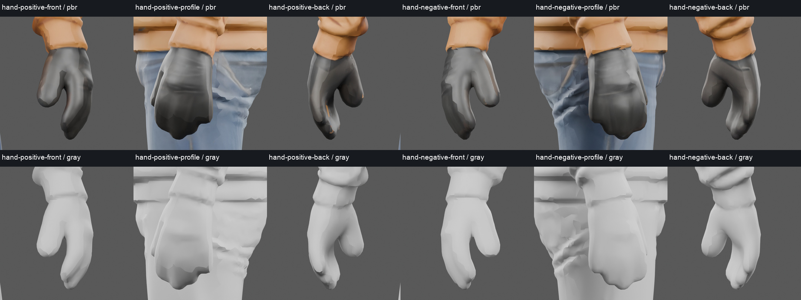
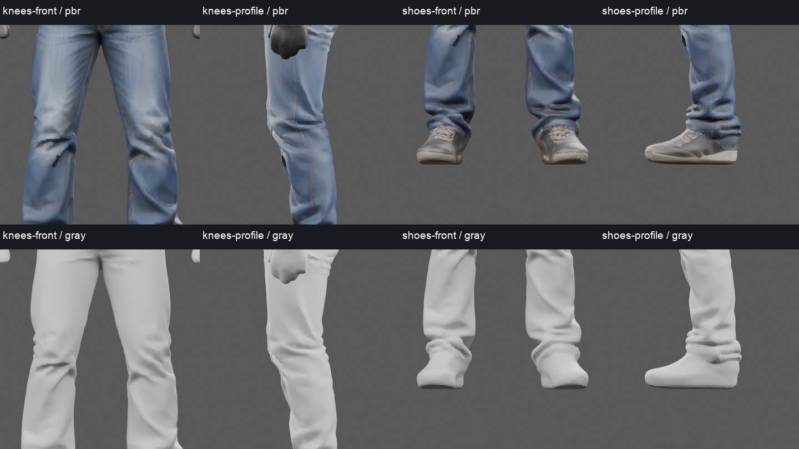
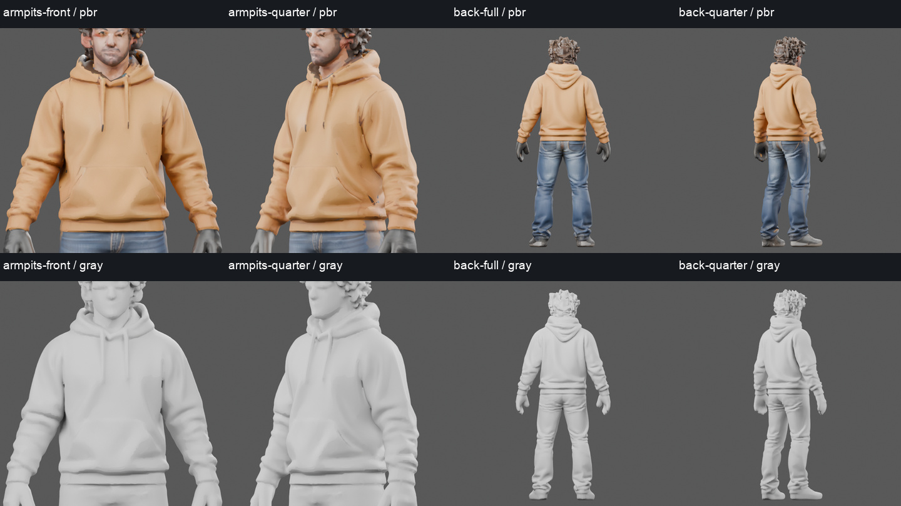

# H21-4 body and contact preflight

Read-only source diagnostics, 2026-09-30. Parent inspected the hand, leg and full-back boards; no repair,
rigging, animation or gameplay acceptance. The pictured old face/hair are
rejected and remain visible only because this inspection preserves donor bytes.

Matched native PBR and neutral-gray frames use Blender5.2.1 Cycles CPU,
four threads,24 samples,640×640, identical cameras/lights and a1.8m display
height. This height includes the rejected old hair. The final replacement
must establish anatomical stature again.28 detail frames completed; all frame
hashes and source before/after hashes match. Full-resolution frames remain in
the ignored LocalAI runtime path listed in [inspection.json](inspection.json).

Reproduce from a fresh output directory with the frozen recipe:
`/Applications/Blender.app/Contents/MacOS/Blender -b -t 4 --factory-startup --python-exit-code 1 --python assets/blender/hero-remaster/rider/one-rider-v2/body-audit/inspect_body.py`.
Existing inspection manifests are deliberately refused. Board composition is
pixel-only through `compose_report.py`; it verifies all28 frames before writing.

The cuffs and wrists are connected in the source; there is no current static
gap between sleeve and hand. Both hands are mitten-like gloves, with fused
finger masses, oversized rounded thumbs and insufficient knuckle/finger
structure. The profile views show depth, so their problem is actual anatomy,
not just a texture. Neutral gray retains the same shape defects. Native PBR
also has broad dark facets at fingertips/cuff transitions. A socket placed
inside either glove would not prove visible wrapping of a handlebar.

The knees have real coarse crease geometry. The two folds differ and one
front crease reads as a dark slash, but it is not an open boundary in the
position-weld diagnostic. Shoes have recognizable side silhouettes and
PBR laces, but the neutral-gray frontal toe/sole edges are irregular and lack
the definition of the textured side. These need localized smoothing and a
clean contact sole before judging moving pedal/peg contact. Don’t smooth the
whole jeans surface or erase the useful cloth folds.

The hoodie back is continuous in these views; its hood silhouette is useful
and must be protected during neck replacement. There is no visible hole in
the inspected back. Armpits form deep folds where sleeve and torso meet;
these are connected surfaces, not separate overlapping garment parts.
They need deformation review rather than an unsupported claim that the
source has no intersections. No triangle self-intersection test was run.

## Measured topology and retained source

Working source SHA256:
`f657aa963f2e582a9f70291b3dbd160dafd6e944419d48b21b0425521d4cd63a`.
Its55,000 triangles/38,363 stored vertices become27,468 unique position
vertices at8 decimal digits. It has one connected component, zero boundary
edges, zero edges with more than two incident faces, and zero collapsed
index faces after position welding. UV seam duplicates are therefore not
mesh holes. This does not prove acceptable anatomy or self-intersection-free
geometry.

Raw decoded NPZ SHA256:
`4a10d00eb42b08910e015efe117f6b28f07be2c7d76e311613a38ac5303d0247`.
It retains344,456 faces/172,223 vertices,17 components,10 repeated-index
faces and10 nonmanifold edges under the same position-weld calculation.
The largest component has171,749 vertices. The other16 components are
small floaters. Raw coordinates have a different orientation from the
display GLB; raw overall depth bounds include floaters. No source was
cleaned or replaced by this inspection. The reduced working export is
not mislabeled as the untouched decoder output.

## Provisional landmarks and actual runtime constraints

[landmark-probes.json](landmark-probes.json) records candidate joint-centre
estimates and their uncertainty. These are visually estimated centres inside
clothing, not discovered bones: there is no armature in H21-4. Lateral/height
uncertainty is approximately30mm and depth50mm. The1.8m frame is BlenderZ-up,
front-Y and lateralX. Proposed conversion is runtime(X,Y,Z)=(-Y,Z,X), with
left/right resolved against actual sockets rather than screen orientation.

| Segment | Provisional visible-body estimate | Fixed physical contract |
|---|---:|---:|
| Pelvis to shoulder centre |0.470m|0.520m|
| Upper arm |0.266m|0.320m|
| Forearm |0.228m|0.270m|
| Thigh |0.443m|0.460m|
| Shin |0.396m|0.430m|

The source’s arms appear relatively short for the fixed physical contract.
One uniform scale cannot make every segment agree. These estimates guide
anatomical review; they must not be presented as final bind measurements or
used blindly to position a skeleton. The new head’s final dimensions and
targeted hand reconstruction will change the measurements.

The existing19 deform bones and their order are recorded in the JSON. New
skin weights, inverse bind matrices and rest transforms must be created for
this body. Keep physical COM and `riderRigFromCOM` authoritative. Runtime
reads arm/leg lengths from new bind joints, so adapting rest joints changes
its visible IK reach: measure and validate the explicit adapter against the
fixed physical targets rather than altering physics to make the mesh fit.

The pelvis convention is20mm below hip centre along the torso; file coordinates
include the0.65m axle shift. Shoulder half-spacing0.21m and hip half-spacing
0.09m belong to the physical model. Forearm/hand rest orientation needs a
recorded mapping: runtime subtracts the loaded grip socket offset to solve
the wrist, then locks the hand to its loaded grip rest quaternion. Relaxed
downward gloves cannot simply inherit the old quaternion. Sole sockets use
the11mm-above-peg-axis convention, while actual visible sole separation must
still be measured separately. The19-bone contract has no finger chains.

## One bounded targeted hand correction direction

Reconstruct each glove as a deliberately posed **gripping hand** with a
defined palm, knuckles, four finger volumes and a thumb. Keep them part of
the same mesh: remove only the malformed distal glove patch along a selected
closed wrist loop below the cuff, retopologize its transition, and bridge/weld
the replacement wrist loop to the retained forearm. Do not add floating hand
shells or hide a disconnected wrist with a sleeve. Preserve sleeve UVs and
geometry, transfer the glove PBR/detail locally, and record before/after
surface topology and normals. Match wrist-loop vertex counts before sewing.

Use one separately preserved derivative and at most two corrective passes
for the same hand/wrist defect. Test the whole sewn patch in gray/PBR from
front/profile/rear, then under forearm flexion and wrist rotation, before
claiming anatomy or deformation readiness. Measure palm/finger contact
surfaces on the unchanged bars in seated/maximum-lean/landing/recovery clips;
the19 bones can drive a coherent precurled glove, while actual open/close
finger animation would require an explicit additional helper contract. If
targeted glove sewing fails twice, stop it and propose a specifically bounded
alternative. This audit has not attempted either fix.
