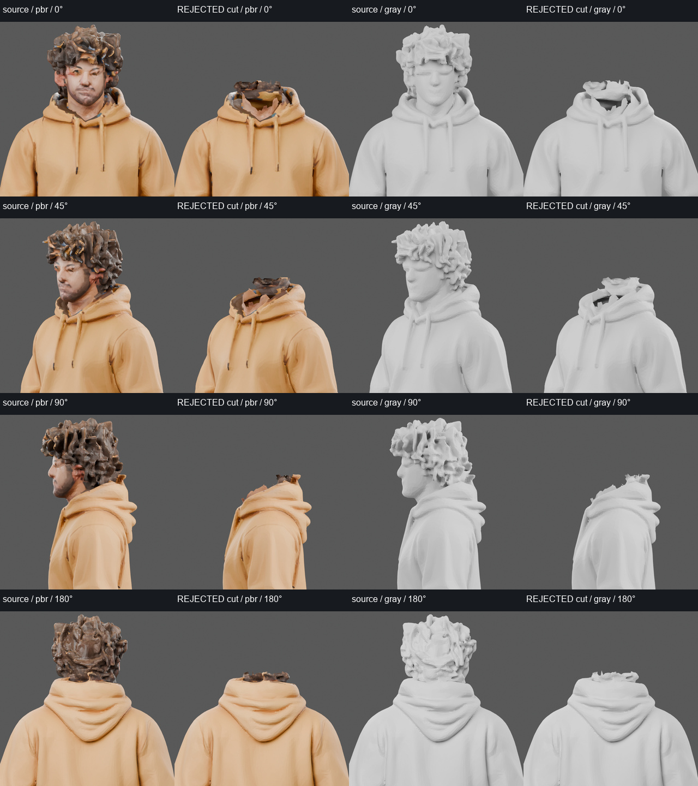

# Rejected nonplanar collar extraction

Parent rejects trial1: a colour-seeded graph cut yields one closed111-edge
collar loop and preserves the broad hood silhouette, but retains old dark
nape/hair and malformed neck skin. Five protected seed triangles were lost
when tiny isolated retained components were discarded. Do not sew a new
bust to this derivative or call the loop a clean join.

Sixteen fixed-world CPU closeups share cameras and lighting; no independent
display normalization enlarges the cut body. All selected source positions
and UVs remain exact under the recorded axes/uniform metre conversion.
Original source bytes are untouched. The derivative has41,343triangles,
111boundary edges and zero nonmanifold edges after position welding.

Reproduce `select_collar.py --out NEW_DIRECTORY`, then CPU Blender
`render_collar.py --input body-open-collar.glb --out NEW_RENDER_DIRECTORY`
(with `--gray` for geometry). `export_collar_control.py` retains all55,000
source triangles for the common control. Frozen settings, hashes and copied
frames are in this directory; masters stay in the recorded ignored runtime.

Next: use explicit spatial collar landmarks and protect actual hood triangles
rather than trusting skin/cloth colour alone. No new head, neck deformation,
character, rig or gameplay acceptance is established. This is one failed
collar extraction; historical jagged/hood-clipping assembly failures remain
separate retained evidence and do not become accepted here.
