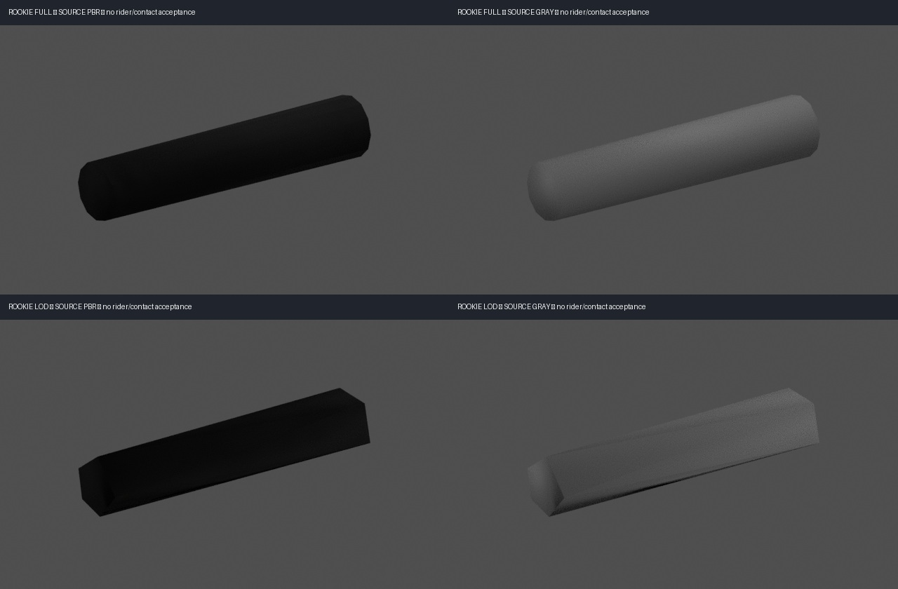

# Actual grip geometry and final capture guards

Status: source geometry measured; no new rider contact fit, reviewed runtime mapping, animation or visual checkpoint accepted. Only the parent judges these source patches and moving evidence.

The final private constructor-identity/live-scene-root guards executed in one authorized fresh silent headless capture after commit `be6d7b2d`. `guard-capture/evidence.json`, `process.json` and `cpu-verification.json` preserve the actual reports. It played/rendered the complete eight-tick prefix, saved frames7/8, reported `constructorIdentity:true`, live rendered scene as rider patch root, no warnings/errors, webdriver true and AudioContext constructions0. All four contact slots stayed explicitly unmeasured because no mapping was supplied. Independent CPU Game replay matched all eight state JSON/hash/phase/run-time samples exactly. This short prefix is integration proof, not a lean/landing/contact gate or clear/finish claim.

The canonical `lockf -k /Users/raynos/projects/localai/.model.lock` bounded the entire browser job. Actual time, memory entry/observed peak and the900s own-process limit are in its process report. No unrelated job was evicted. Everything after that capture was read-only CPU decoding, fitting and Cycles CPU rendering; no further browser run or GPU workload occurred.

## Measurements from exact compressed assets

`measure-grips.mts` decodes the actual frozen-build/public-identical compressed GLBs with the installed MeshoptDecoder, including the EXPONENTIAL position filter. It applies source node hierarchy transforms, splits the handlebar primitive into position-weld connected components at1µm precision, and retains exact source vertex/triangle indices. The explicit inspected grip components are0/L and3/R, node22 `handlebar`, mesh8, primitive0. They are isolated as black rubber with the original atlas UVs, normals and PBR maps preserved. This identity evidence is for parent review; component proximity alone was never marked an accepted mapping.

| Asset | Source SHA256 |
|---|---|
| Rookie full | `e55919d60267849358ef5e97f4731f42fac6eb2835b9998e1d146d056c0f10f7` |
| Rookie LOD | `4ec26ad0a0c08f7ec7e466523b77b4dd5f6378e9b389fade140eb7d08418d36b` |
| Pro full | `0acc9ac86eeca76cc1812f8870eab36e2e25ca76d6a5cbe86d4a46a36cc12a86` |
| Pro LOD | `37455064bf7b6012d67e99454cefced5a1aceac3747796f11cdcfe839436a2b7` |

The Rookie/Pro handlebar position/index/normal/UV geometry hashes match exactly at each corresponding detail level. Their full-bike SHA values differ. The fresh guard capture actively drew Rookie full; the other three measurements read the precise packaged/public-identical bytes, and do not claim those pairs were newly drawn in that capture.

`fit-grips.mts` partitions each explicit grip's vertices into end rings, fits circle centres in a transverse plane by least squares, then measures the actual radial vertex distribution and source face winding. Circle fitting avoids an unevenly sampled LOD ring shifting its mean-vertex centre. Full grips are tapered12-sided surfaces, not perfect cylinders. LOD grips collapse to coarse5-sided surfaces.

| Detail/side (same on both classes) | Mean inner diameter | Mean outer diameter | Axis length | Faces per grip |
|---|---:|---:|---:|---:|
| Full L/R | 33.9678mm | 32.0748mm | 165.8553mm | 44 (24side,20cap) |
| LOD L | 35.5410mm | 33.6922mm | 165.8894mm | 16 (10side,6cap) |
| LOD R | 35.6459mm | 33.4918mm | 165.8594mm | 16 (10side,6cap) |

All eight inspected source components have zero boundary, nonmanifold, inconsistent winding, degenerate or inward faces at the documented weld precision. These counts describe the source grip patches, not the rider's hands or full bike topology. Decimation visibly alters cross sections. A22mm-diameter hand-wrap target is much smaller than the actual full grip, which is about32–34mm in diameter. Those measurements were sent directly to `new_body_contact_audit` before any contact claim.

Full L outward axis in source file frame: `[-0.102658686, 0.005891157, 0.994699195]`; R mirrors the z sign. Full L ring centres:

- Inner file frame: `[0.931984724, 0.778992480, 0.260009874]`.
- Outer file frame: `[0.914958234, 0.779969560, 0.424986040]`.
- Bike frame subtracts the actual source `attach_frame_origin` `[0.649999976, 0, 0]`; complete endpoint/axis fields for all assets are in `fits/`.

The source grip marker is `[0.270000041, 0.779999971, ±0.330000013]` in bike frame. It lies4.7728mm off the full fitted rubber axis. This marker/IK target is not an exact centreline or skin surface. The existing hand bone is the anatomical wrist at `[0.245, 0.835, ±0.33]`, offset from the grip target by the shared `wristFromGrip` contract. Keep wrists, grip sockets and visible palm surfaces distinct; no physics/profile values were edited here.

For the specific tested constant-radius proxy chosen from maximum ring radius, source triangle-lattice distance mismatch reaches1.43–1.46mm on full and4.91–5.41mm on LOD. This is the documented proxy's sampled error, not a mathematical lower bound for every possible cylinder fit. A cylinder proxy cannot silently be accepted as exact visible grip geometry. Use the retained exact triangle patches for fitting; any future primitive mapping needs its own disclosed approximation review. The same rider hand may need distinct full/LOD contact treatment while preserving the shared physical IK targets.

## Source isolation and reproducibility

The footpeg audit in `pegs/` decodes the separate actual `pegs` node/mesh and retains every source triangle, normal and UV. Its primary full source platform candidates are rounded boxes about100.10mm fore/aft ×11.96mm thick ×109.99mm across the lateral span. Full platform top is bike-frame y25.981mm; the separate grip teeth reach30.986mm, close to the existing31mm sole-socket target. That agreement is a source geometry observation, not visible sole-contact proof. Supports and teeth are separate components, so a platform AABB alone does not represent the entire sole contact surface. `pegs/summary.json` records corresponding LOD candidates and winding/boundary counts. Some LOD teeth collapse to isolated one-triangle surfaces with open edges. This is preserved existing-bike evidence; no out-of-scope repair or bike change was attempted. Rounded-box/teeth surfaces must not receive a passing cylinder approximation. The present capsule/cylinder surface helper cannot measure exact footpeg surfaces until a reviewed box/triangle target implementation and new rider patch mapping exist; foot contacts remain unmeasured.



`isolation/pro-source-grips.jpg` supplies the corresponding Pro board. These are actual source patch CPU renders, not rider mockups or posed gameplay evidence. Original normal/ORM/albedo images were copied byte-for-byte into the ignored isolated GLBs; UVs, normals and triangle winding were preserved. Neutral-gray views use the same camera, lights and geometry. Blender5.2.1 LTS, Cycles CPU,16samples, denoising off,640×384, orthographic scale235mm. Lighting initially overexposed the dark material; those bright trials remain under ignored masters. The retained boards use the corrected matched low-energy lighting and show the original dark rubber.

Ignored masters/settings/results: `harness/out/hero-remaster/contact-targets/decoded-frame/`, `fitted-frame/`, `render-*-lowlight/` and `guard-capture/`. The exact selected source triangle/vertex indices, ring distributions, coordinate frames, primitive-error measurements, source hashes and isolation hashes are committed as review data in `fits/`. They are source patch definitions, not runtime merged-mesh indices. Converting to runtime indices still requires explicit source/geometry binding and parent review.

Reproduce CPU geometry with:

```sh
pnpm exec tsx harness/hero-remaster/contact-targets/measure-grips.mts FROZEN_BUILD FRESH_DECODE_DIRECTORY
pnpm exec tsx harness/hero-remaster/contact-targets/fit-grips.mts DECODE_DIRECTORY FRESH_FIT_DIRECTORY
```

`render-isolation.py` and `compose-isolation.py` hold the matched rendering and pixel-only board recipe. Harness typecheck and focused lint pass. `validation.json` records current recipes and source/report geometry hashes. No bike, rider, physics, public asset, shared plan/ask/journal or commit was changed by this builder.
