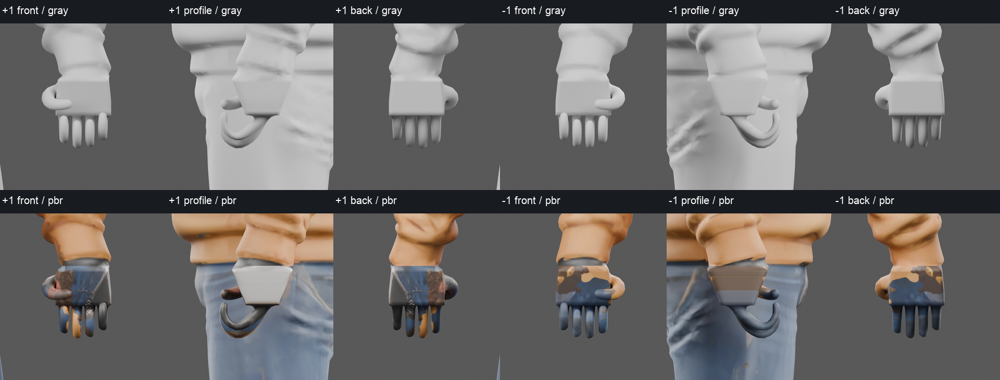

# Explicit glove branches — trial1 rejected appearance

**Parent rejected the gray appearance.** The palm is a rectangular slab, and
the knuckle/finger transition is unnatural. This is construction and sewing
feasibility evidence, not acceptable rider anatomy. No bake or further
construction correction followed that verdict.

The derivative has four distinct curved fingers and an opposing thumb per
hand, beginning at real shared-index palm outlets. Its actual source wrist
loops are sewn by bridge triangles. It contains one connected component,
30,416 position vertices,56,866 mixed polygons and60,896 rendered triangles,
with zero boundary/nonmanifold edges. The topology does not excuse the visible
slab palm or establish natural contact.

## Preserved body and setup failures

Two setup errors were retained separately before this appearance review:

1. The first thumb outlet touched the open wrist band and failed its closed
   loop assertion. An intact band and corrected sidewall indices fixed it.
2. The initial broad lateral threshold also selected outer shoe vertices and
   left a thumb fragment. This was a material source-preservation failure,
   not a usable hand. Its22 boundary edges and failed master remain explicit
   failure evidence. The final correction deletes only the connected distal
   glove component seeded in each hand below its actual wrist cut; no broad
   x/z vertex deletion remains.

All source foot/knee vertices are now explicitly protected. The final saved
derivative independently matches the pre-cut protected position and face-loop
UV fingerprints. The protected region is `abs(X)<0.24 OR Z>=0.92 OR Z<0.70`
in the1.8m normalized Blender frame. Positions and face/UV tuples are rounded
to7 decimals for hashing. These checks cover all feet/knees, intact cuffs,
sleeves, hood and torso; topology edge counts are a separate test. Normal
vectors were recalculated on the derivative and were not hash-preserved.
The original source GLB and dense NPZ remain byte-identical.

Source GLB:
`f657aa963f2e582a9f70291b3dbd160dafd6e944419d48b21b0425521d4cd63a`.
The dense NPZ stays
`4a10d00eb42b08910e015efe117f6b28f07be2c7d76e311613a38ac5303d0247`.
The rejected old H21-4 head/hair remain in this isolated body derivative;
they are never accepted by this glove evidence.

## Intersection and temporary motion evidence

The rest-pose triangle BVH reported no nonadjacent candidate pairs involving
new glove triangles. Shared-vertex neighbors were excluded. An additional SAT
test would evaluate candidates at1e-7m tolerance; here there were zero such
pairs to evaluate. This is a rest-pose diagnostic, not exhaustive deformed
self-collision or bike-contact validation.

[Play temporary seam motion](temporary-seam-motion.mp4):36 samples at12fps,
3.0seconds, both wrists side by side, no audio. Each side uses a temporary
forearm/hand pair under a diagnostic root. Wrist flex reaches approximately
±30°, wrist twist±40° and forearm flex±18°. The source cuff and sewn
transition deform together, exposing creases and the rejected palm silhouette.
No full19-bone bind/socket contract, physics-driven lean, IK, gameplay grip,
sole contact or Garage blend is present in this diagnostic rig.

12 static and72 individual motion frames completed on CyclesCPU with four
threads,24 samples. Frame SHA checks and the encoded36-frame single video
stream are verified in [verification.json](verification.json). The camera,
source fingerprints, connected-component and intersection results are in
[inspection.json](inspection.json). New glove UVs and dark PBR shader are
provisional; retained body PBR is preserved. No texture bake was attempted.

Ignored masters live under
`~/projects/localai/runtime/rockhop-rider-search-v1/one-rider-v2/glove-cleanup/ring-loft-trial1/`:
`body-gloves.blend`, `body-gloves.glb`, two authored pre-subdivision NPZs and
`temporary-wrist-diagnostic.blend`. `failed-sewn-body.blend` is explicitly the
invalid pre-correction ROI failure. No normal game assets changed.

## Specific next correction proposal — not executed

Use a **freshly instantiated anatomical MPFB hand** as the new cage, rather
than the slab-shaped procedural palm. The installed MPFB `data/3dobjs/base.obj`
has an explicitCC0 asset header, SHA
`8e761e6624b8f54536409135d1636da63b32486a90d4897f84e121d144f6fb4c`.
Its standard weights expose all five three-phalange chains per side. Create a
new base directly, extract the palm/finger/thenar topology, pose it into a
gripping glove, and bridge its actual wrist loop to the protected H21-4 cuff
transition. This uses no historical production shell. The anatomical palm
must have a narrow rounded wrist, asymmetric metacarpal flare, curved knuckle
arch and natural webs. Parent must commit this finding before authorizing
that next isolated trial. No MPFB hand was created during this proposal.
