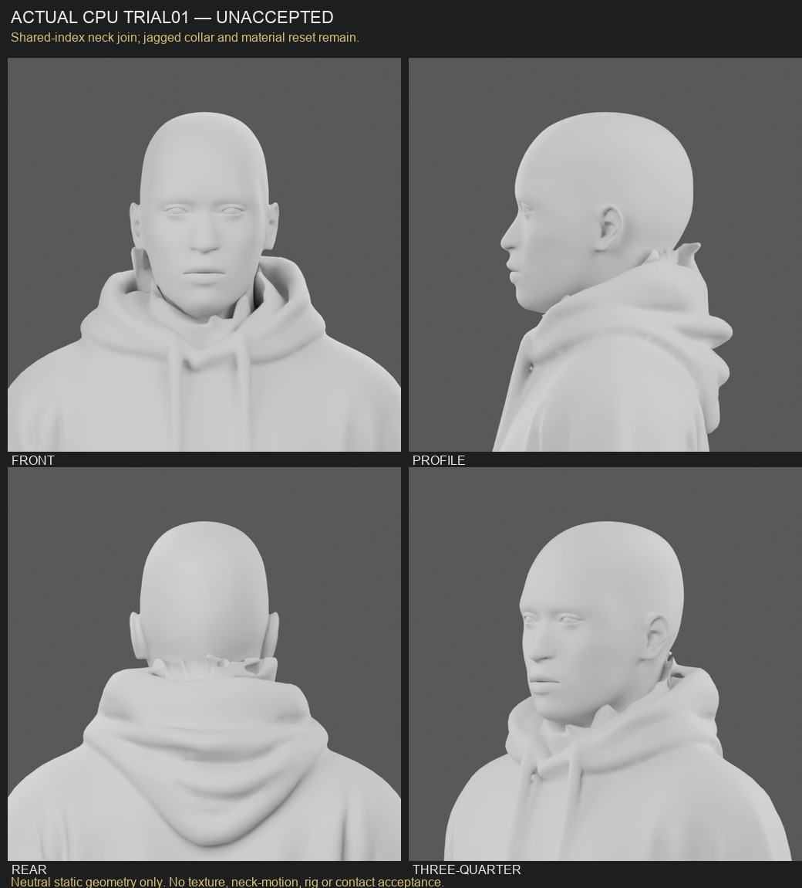

# Native BMesh neck feasibility — first trial rejected by parent

This trial joins the NEW native v6 head to the NEW neutral anatomical-hand body. The body, native head and retained collar mask remain byte-identical. The old source head is removed in this derivative only. No historical production rider, graph-cut rerun, ellipse, global remesh, GPU, rig, physics edit or asset promotion is involved.

The exact retained trial1 source mask removes all **13,657** historical head triangles. Signature-only rounding was insufficient in the initial read-only probe; the preserved `probe.json` shows that incomplete correspondence. The corrected triangle-center plus all-corner comparison within **2µm** matches every required deletion and yields one actual **111-vertex** hood boundary. No meshes were exported from either probe.

The first native join uses the actual collar topology. Eight adjacency-Laplacian fairing steps affect only a **35mm** Euclidean band around that boundary, tapered toward its outside edge and clamped to **12mm** total displacement. The native head receives one uniform **0.42** scale and world-Z offset **1.59338m**, with no Y adjustment. Only its new neck is bisected at world Z **1.49m**; the hood is not clipped. The resulting **200-vertex** skin neck boundary is sewn to the actual cloth rim through a shared **111-vertex** inside-facing ring and **422** new faces. Native face and eye geometry/UVs remain fixed outside that recorded neck trim.

## Actual result and defects

The parent reviewed the actual front/profile/rear views and **rejected trial01** for its tall thin jagged collar/nape protrusions and material-index reset. No correction has run. The one bounded proposed correction is in `next-correction-proposal.md`.

The saved body/head mesh has **zero boundary edges**, **zero nonmanifold edges**, **zero inconsistent edge winding**, and one connected component. These are feasibility results, not character acceptance. The rear and profile views still show conspicuous jagged collar protrusions. The bounded local fairing did not produce a clean collar silhouette. Texture/normal continuity, neck rotation/bending and moving contacts remain unmeasured.

The first trial also contains a concrete material failure: clearing material slots after BMesh conversion reset **all 110,457 body polygons to material 0**. The saved file contains the intended four slots, but its face assignments are wrong, and the exported GLB has one body primitive. In particular, the new native face must not receive the H21 body atlas. This trial has no accepted skin/glove/lining material assignment. It is preserved without a correction or texture trial.

A specific later material correction is to preserve the per-face material-index array, keep/append slots, then assign indices after any slot manipulation. That correction must follow the parent checkpoint/review; it was not run here. Improving the jagged collar is a separate visual defect and needs deliberate local cloth work rather than using a material correction as a geometry claim.

## Independent preservation evidence

`trial01/outside-band-audit.json` reopens the immutable original body and frozen joined file. It compares complete protected source polygon corners, including loop UVs, outside the original 35mm collar band and exact historical-head deletion. All **40,859** protected original polygons retain their positions and loop UVs; **3,527** original protected material assignments are missing after the reset. This protects the hands, legs, feet and broad hood geometry/UVs, while documenting the actual material failure. Geometry/UV preservation and material preservation are reported separately; final material assignments failed.

`trial01/corner-precision-audit.json` compares actual pre/post-GLB export corners by nearest triangle center and all three geometric corners. All **189,676** triangles match one-to-one, maximum world-corner position error is **0**, maximum UV error is **2.98e-8**, and actual pre/post material names agree. That agreement preserves the already-wrong material assignment; it does not approve intended skin/clothing materials.

The earlier coarse rounded corner fingerprint in `audit.json` reports 1,028 unmatched entries. The later precision audit resolves those as rounding-bin artifacts, with no triangles missing or displaced. Both reports remain preserved.

The four gray views are actual GLB-reimport renders, **Cycles CPU**, **4 threads**, **16 samples**, 640×640, with common studio lighting. They are static diagnostic views, not played animation evidence. `board.json` records pixel-only resize/layout/labels. No native texture from the upcoming head-material trial was applied.

## Files and next gate

Builder recipes are in `assets/blender/hero-remaster/rider/one-rider-v2/neck-native/`. Exact source/output hashes and settings are in `trial01/report.json`; actual material counts and render proof are in `trial01/audit.json`. Masters and the precision-audit arrays remain ignored under `/Users/raynos/projects/localai/runtime/rockhop-rider-search-v1/one-rider-v2/neck-native/trial01/`.

The parent must judge the actual four views and commit this explicitly unaccepted finding before another corrective trial. No character, neck join, normal continuity, rig, contact or game-ready claim is accepted here. This native fairing technique has one frozen visual trial; prior colour cuts and elliptical loft techniques remain stopped.
