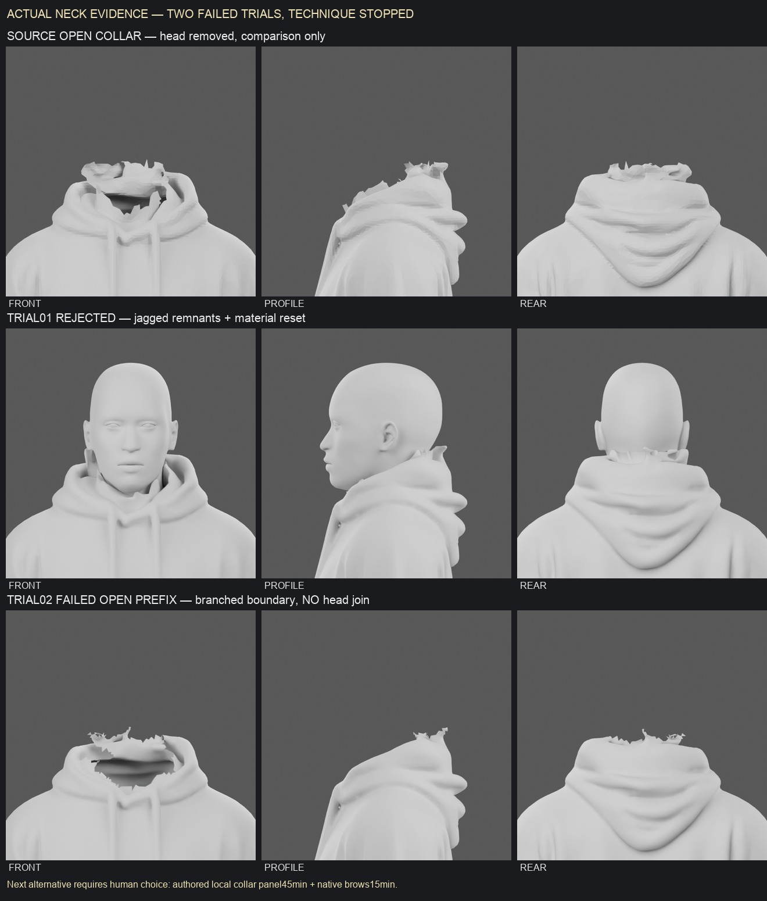

# Native collar stopped after two failures

Rows show the preserved source open collar (comparison only), rejected trial01 and failed trial02's **open prefix without any new head or join**. Columns show front/profile/rear. Cameras, lighting, resolution and gray materials match; this is actual CPU render evidence. The source baseline is the unchanged collar-trial1 GLB, not a new selection or production rider.

The fixed FOUR-ring correction admitted **230 / 109 / 127 / 119 faces**, removing **585** original source triangles entirely within the authorized 35mm band. It left **172 boundary edges**, **170 boundary vertices** and **two degree-four branch vertices**. The other 168 vertices have degree two. One connected component therefore does not constitute a simple boundary circuit. The builder stopped at that guard: no broadening, fill, head join, material refinement, texture stage, neck motion or rig followed.

The original failure record is `trial02/report.json`. The independently authorized forensic replay uses the unchanged recipe prefix/settings up to the failing loop check, exports that actual failed state, records exact source triangle identities, boundary degrees/components and source hashes, and preserves the original failure record. It is **not a third trial or repair**. The proof is in `trial02/forensic.json`; actual failed-prefix views are recorded in `trial02/gray-witness.json`.

The concrete alternative in `manual-panel-choice.md` is an explicitly authored local garment panel using reviewed seam landmarks, with a fresh hard cap of **45 minutes collar + 15 minutes native brows**. It preserves the new native face/eyes, broad source hood, limbs, material/UV contract and existing physics. It requires human choice and **has not been executed**. The failed native heuristic/ring technique stays stopped.

The second correction and forensic work were authorized with a ceiling of **2026-10-01 00:56:00 UTC**, within the unchanged overall model budget. Work froze early, with actual artifact timestamps and hashes in `freeze.json`. No further Blender or asset refinement job is running. No character, neck join, normal continuity, rig, contact or game-ready claim is accepted.
