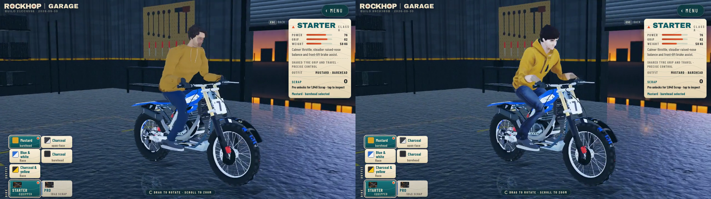

# Whole-rider restart

Ask 214 rejects the current complete body. The first matched visual comparison
supports that decision: the current face is paler and more juvenile, and the
thin uneven forearms remain visually broken. Cloth detail cannot compensate.
The original also has flat/faceted clothing; it is a baseline, not the target.

Left is the original Street model recovered from Git revision
`ec04192d61e39dcc8bdb80fd97842e8019ef4e55`; right is current V6.
Both enter the actual Menu and Garage and rotate through a full orbit.

[Play the actual before/current orbit](before-current-orbit.mp4).
[Capture and served-SHA audit](before-current-review.json).

Camera, 1280×720 viewport, render tier/DPR, antialiasing, active Garage lighting
and all 18 non-rider model hashes match. Only the two Street full/LOD model
hashes differ. Both load all 20 catalog models with zero page errors. The
baked version headers differ and the original/current native idle clips differ;
this is a whole-presentation comparison, not identical bone-pose isolation.
Concurrent Coast assets remain disabled. No injected pose or public replacement.

[Current rendered low/high replay](current-replay.json) clears at tick 4810,
40.083333333333336 seconds, identical finish bytes `abaaaaaaaa0a4440`; crash
and instant tick-zero restart pass. This host proxy does not qualify phone pacing.

The next candidate starts from a fresh MPFB/MakeHuman adult body generated
in Blender, with newly authored clothing, gloves, shoes and hair. Reuse the
numeric game rig and contact contracts only. Judge the complete rotating and
riding body before polish or propagation. Skin/head patch experiments are
frozen and unaccepted; the active hero plan remains open.
