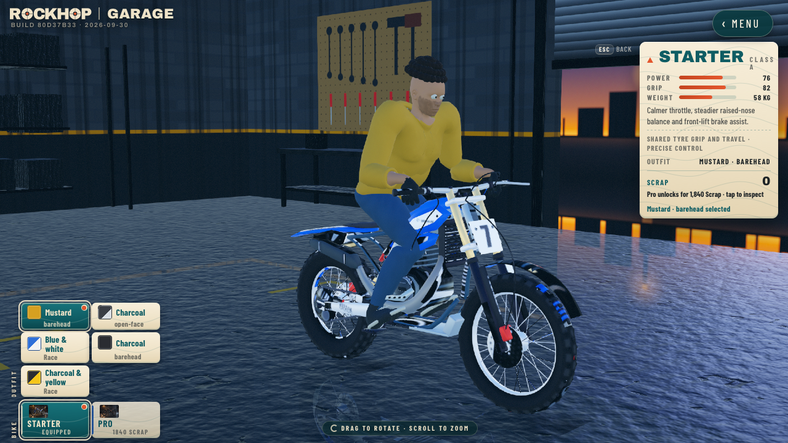

# First fresh complete rider: rejected shape pass

Parent judges the actual [Garage rotation](whole-rider-v1-parent-garage.mp4),
[12-second recorded ride](whole-rider-v1-parent-ride.mp4) and
[close high ride](whole-rider-v1-parent-close-ride.mp4) and
[close low ride](whole-rider-v1-parent-close-low.mp4), not a Blender still.
The frozen first shape hashes are full `d0a1533a…` and LOD `e8f42657…`.

The adult base and warm skin establish a coherent starting source, but this
complete candidate is rejected. Eyes protrude outside eyelids; shoulders and
chest balloon instead of forming hoodie drape; a palm/fingers miss the bar;
hair, jeans and shoe/ankle shape remain unfinished. Passing numeric contacts
cannot accept the visible hands. Correct these as a complete shape round.

[Served hashes and capture audit](whole-rider-v1-parent-review.json).
Full/LOD numeric contracts pass 19 bones, four sockets and six clips:
46,220 / 7,799 triangles, seven draws, worst sampled clip drift 0.092 mm.
[Full](whole-rider-v1-parent-full-contract.json) /
[LOD](whole-rider-v1-parent-lod-contract.json).
Garage and close capture have zero page errors. The high ride records two
concurrent track-budget/preload warnings, not a clean release qualification.

The builder accidentally overwrote named outputs during a reproduction attempt.
These consumed bytes remain immutable in the captured build; deterministic
source correction uses a new revision. The corrected [rebuild proof](whole-rider-v1-rebuild-proof.json) reproduces
the first full hash exactly; its deterministic LOD has a new `92a009ad…`
hash. This review continues to reference the original `e8f42657…` LOD. No public asset is
replaced; body art, exact surface contact and physical-device acceptance remain open.

[Low/high replay](whole-rider-v1-parent-replay.json) finishes at tick 4810
with identical finish bytes `abaaaaaaaa0a4440`; crash/tick-zero restart passes.
