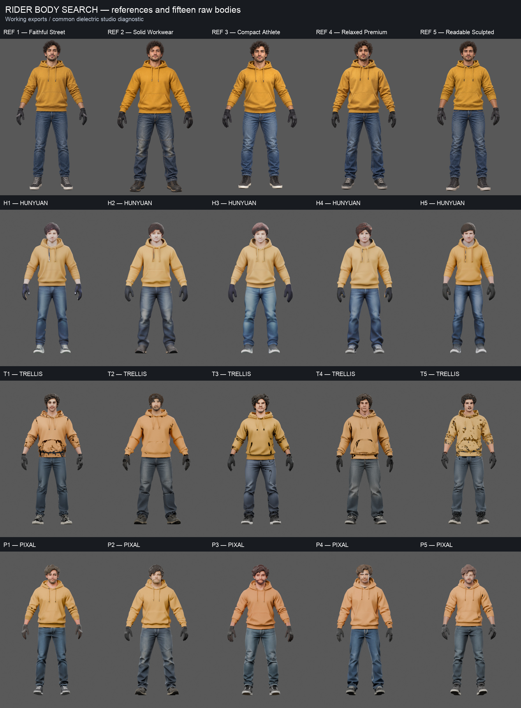

# Fifteen rider bodies — checkpoint 1 review

Status: unaccepted body search, 2026-09-30. H = Hunyuan3D, T = TRELLIS.2,
P = additive Pixal3D. Numbers identify the same five frozen references.
No existing comparison or normal player asset has been replaced.

The parent recommends **P3 for refinement**, subject to your visual choice.
It retains adult proportions, coherent hoodie volume, denim and shoes across
nine views better than the current Hunyuan lane. The face is stylized and the
hands remain soft. Dark patches around the sleeve/hoodie are visible.
The [gray export diagnosis](../diagnostics/pixal03/README.md) confirms that the
lower-back painted patch is not a large geometry opening there; small hood/
ankle/shoe breaks and problematic export topology remain. These require a
bounded correction before body acceptance.

Hunyuan's current turbo recipe makes smooth, coherent bodies but loses the
adult face, finger separation and shoe detail. TRELLIS retains useful adult
anatomy/detail in native geometry, while its working exports introduce large
surface tears. This is a result for these installed recipes, not a universal
ranking of the generators. Pixal runs 1024cascade versus TRELLIS512; its native
export additionally remeshes/cleans/reduces. Settings are disclosed in manifests.

P1 is a balanced but younger-looking alternative; P2 has a stronger frame and
blurrier face; P4 has a looser hoodie and older-looking face; P5 has a larger
head and visible hoodie openings. None has passed close hand/topology review,
skinning, sitting, riding contact or physical device tests.

## Matched target and actual boards

These layouts preserve aspect ratio and source pixels, without repainting.
Imagegen targets have approximate angles and occasional view inconsistencies;
actual Blender camera yaws are exact. Open original boards for full detail.

| Design | Target plus all three actual nine-view boards |
|---|---|
| 1 — Faithful Street | [Comparison](design-01-comparison.jpg) |
| 2 — Solid Workwear | [Comparison](design-02-comparison.jpg) |
| 3 — Compact Athlete | [Comparison](design-03-comparison.jpg) |
| 4 — Relaxed Premium | [Comparison](design-04-comparison.jpg) |
| 5 — Readable Sculpted | [Comparison](design-05-comparison.jpg) |

## Whole models and complete moving orbits

Every board contains the same body at yaw 0/40/80/120/160/200/240/280/320°.
Every orbit contains 36 frames at 12 fps. Pixal cameras have a recorded 180°
front-axis offset; source geometry stays frozen. All three working materials
use the same explicitly recorded metallic-zero diagnostic. Native PBR source
bytes remain intact. Gray native geometry is independent of texture/export.

| Body | Working nine views | Complete orbit | Native geometry | Reduced export |
|---|---|---|---|---|
| H1 | [Board](../baseline/hunyuan/01/working/board.png) | [Orbit](../baseline/hunyuan/01/working/orbit.mp4) | [Gray](../baseline/hunyuan/01/native-gray/board.png) | [Reduced](../baseline/hunyuan/01/reduced/board.png) |
| H2 | [Board](../baseline/hunyuan/02/working/board.png) | [Orbit](../baseline/hunyuan/02/working/orbit.mp4) | [Gray](../baseline/hunyuan/02/native-gray/board.png) | [Reduced](../baseline/hunyuan/02/reduced/board.png) |
| H3 | [Board](../baseline/hunyuan/03/working/board.png) | [Orbit](../baseline/hunyuan/03/working/orbit.mp4) | [Gray](../baseline/hunyuan/03/native-gray/board.png) | [Reduced](../baseline/hunyuan/03/reduced/board.png) |
| H4 | [Board](../baseline/hunyuan/04/working/board.png) | [Orbit](../baseline/hunyuan/04/working/orbit.mp4) | [Gray](../baseline/hunyuan/04/native-gray/board.png) | [Reduced](../baseline/hunyuan/04/reduced/board.png) |
| H5 | [Board](../baseline/hunyuan/05/working/board.png) | [Orbit](../baseline/hunyuan/05/working/orbit.mp4) | [Gray](../baseline/hunyuan/05/native-gray/board.png) | [Reduced](../baseline/hunyuan/05/reduced/board.png) |
| T1 | [Board](../baseline/trellis/01/working/board.png) | [Orbit](../baseline/trellis/01/working/orbit.mp4) | [Gray](../baseline/trellis/01/native-gray/board.png) | [Reduced](../baseline/trellis/01/reduced/board.png) |
| T2 | [Board](../baseline/trellis/02/working/board.png) | [Orbit](../baseline/trellis/02/working/orbit.mp4) | [Gray](../baseline/trellis/02/native-gray/board.png) | [Reduced](../baseline/trellis/02/reduced/board.png) |
| T3 | [Board](../baseline/trellis/03/working/board.png) | [Orbit](../baseline/trellis/03/working/orbit.mp4) | [Gray](../baseline/trellis/03/native-gray/board.png) | [Reduced](../baseline/trellis/03/reduced/board.png) |
| T4 | [Board](../baseline/trellis/04/working/board.png) | [Orbit](../baseline/trellis/04/working/orbit.mp4) | [Gray](../baseline/trellis/04/native-gray/board.png) | [Reduced](../baseline/trellis/04/reduced/board.png) |
| T5 | [Board](../baseline/trellis/05/working/board.png) | [Orbit](../baseline/trellis/05/working/orbit.mp4) | [Gray](../baseline/trellis/05/native-gray/board.png) | [Reduced](../baseline/trellis/05/reduced/board.png) |
| P1 | [Board](../pixal/01/working/board.png) | [Orbit](../pixal/01/working/orbit.mp4) | [Gray](../pixal/01/native-gray/board.png) | [Reduced](../pixal/01/reduced/board.png) |
| P2 | [Board](../pixal/02/working/board.png) | [Orbit](../pixal/02/working/orbit.mp4) | [Gray](../pixal/02/native-gray/board.png) | [Reduced](../pixal/02/reduced/board.png) |
| P3 | [Board](../pixal/03/working/board.png) | [Orbit](../pixal/03/working/orbit.mp4) | [Gray](../pixal/03/native-gray/board.png) | [Reduced](../pixal/03/reduced/board.png) |
| P4 | [Board](../pixal/04/working/board.png) | [Orbit](../pixal/04/working/orbit.mp4) | [Gray](../pixal/04/native-gray/board.png) | [Reduced](../pixal/04/reduced/board.png) |
| P5 | [Board](../pixal/05/working/board.png) | [Orbit](../pixal/05/working/orbit.mp4) | [Gray](../pixal/05/native-gray/board.png) | [Reduced](../pixal/05/reduced/board.png) |

[Native front overview](native-overview.jpg) exposes source geometry. SHA,
camera and frame integrity are verified in the baseline/Pixal reports. The
parent's visual observations do not assert a played sitting/gameplay pass.
The [original A1/A2 controls](../../rider-selection/README.md) remain available.

## Bounded correction evidence

[T1 export correction 1](../variants/trellis-01-export1/README.md) closes much
of the giant export tearing, but still leaves unacceptable pitted cloth,
wrists and shoes. T-EXPORT-01 has **one failed fix**. The original fifteen-body
comparison stays frozen; no other body silently receives this variant.

[Defect ledger](../defect-ledger.json) preserves candidate hashes and counts;
[motion preflight](../gate2-preflight.md) records the existing physical contract
and what the prior UniMate test actually demonstrated. Both later gates remain
unstarted until the selected body passes checkpoint 1.

## Requested additional model

Ask228 adds [five Hunyuan3D 2.1 bodies and a separate twenty-body overview](../hunyuan21/README.md),
preserving every H/T/P body and board above. H21-4 is the strongest new
alternative; no visual direction or body is accepted.
