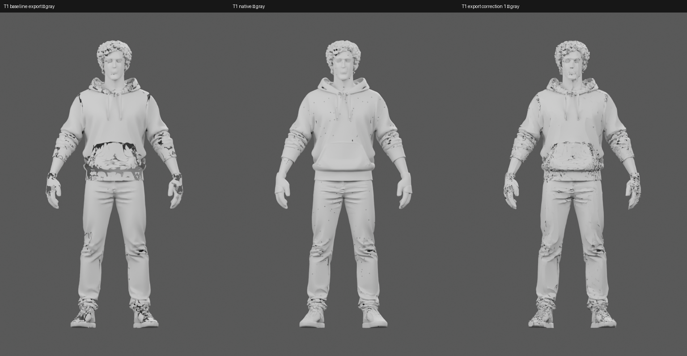

# T1 export correction — attempt 1

Status: **partial improvement, failed body-quality gate**, 2026-09-30.
Defect ID T-EXPORT-01; one failed fix recorded. Baseline remains intact.

Hypothesis: the provider's aggressive export cleanup/simplification creates
large tears beyond the smaller holes in native geometry. Re-export the same
native mesh/voxel attributes at 200k requested faces/2048, without remesh,
then use the frozen Blender DECIMATE recipe to reach 55k/2048. No new model
generation, rig fit, bind, posing, texture repaint or physics change.

Actual high-face export: 186,392 triangles. Blender copy: exactly 55,000.
Source/config hashes and the exact native NPZ are recorded in verification.json
and working.reduction.json. Ignored GLB masters remain at recorded runtime paths.

Parent verdict: the giant open pocket/wrist tears are reduced, but rough,
pitted cloth and glove/shoe breakup remain on front, sides and rear. This
correction does not produce an acceptable whole body. The raw native geometry
in the middle remains visibly cleaner than either working export. A different
export approach may be worth one remaining bounded pass if you choose T1.
Do not silently apply this correction to the other frozen designs.

- [Actual corrected nine-angle textured board](working/board.png)
- [Actual corrected nine-angle gray geometry](gray-full/board.png)
- [Complete corrected orbit](working/orbit.mp4)
- [Original T1 orbit](../../baseline/trellis/01/working/orbit.mp4)
- [Original native nine-angle geometry](../../baseline/trellis/01/native-gray/board.png)

Validation: 45 frame hashes/cameras, exact 55k-face diagnostic import and a
36-frame/12fps MP4 verified. Every original TRELLIS output hash remains intact.
These are unrigged body diagnostics, not sitting/gameplay acceptance.
