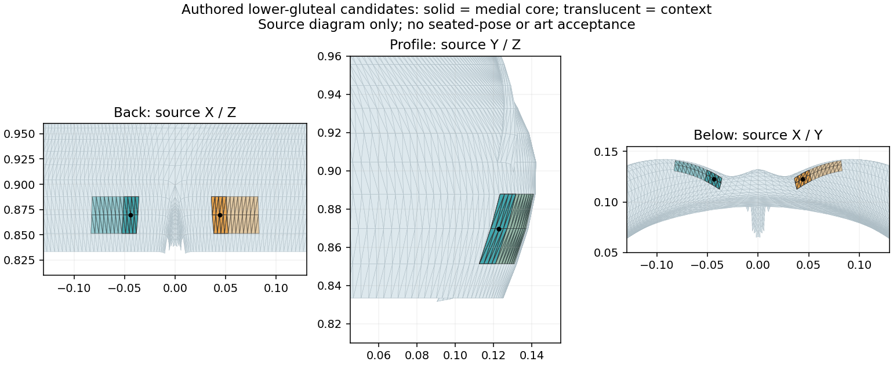
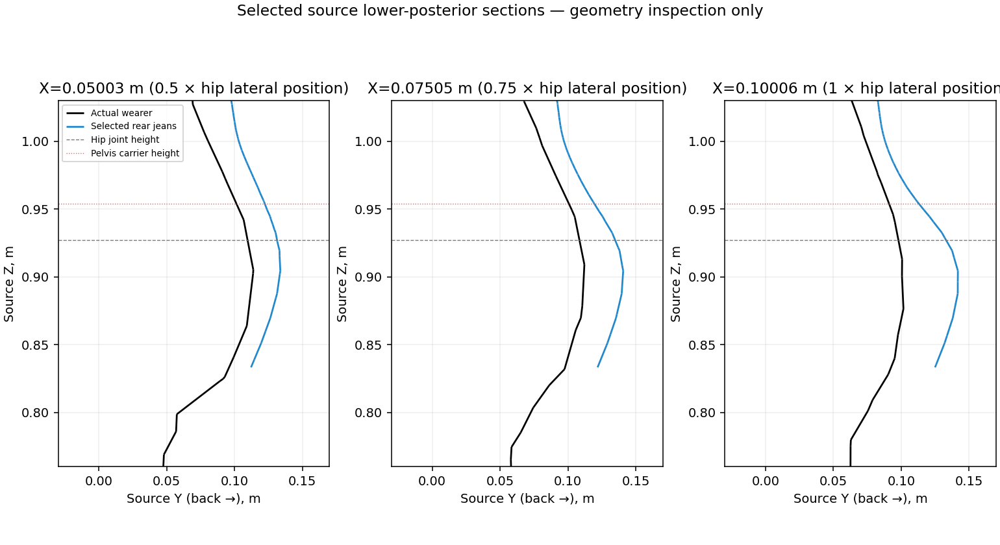

# Explicit bilateral lower-gluteal candidates

**Unaccepted source selection; no seated pose authored or executed.** Exact IDs
are frozen in `assets/blender/rider-rebuild/selected-posterior-support03/patches.json`;
`source-patches.json` contains their triangles, vertices, original named FOUR
fields, boundary edges, areas and underlying body-reference triangle IDs.

Source back/profile photos show the fold below the buttocks; exact wearer/jeans
sections locate the inward-curving underside below the rear-lobe apex near
Z0.9045 and above the crease row nearZ0.8333. The chosen native rows span
Z0.851320–0.887732, with a medial contact core on each gluteal lobe. The cleft,
upper pocket panel and old minimum triangle39434/polygon19717 are excluded.
Selection is anatomical/source-authoring judgment; bone weights are recorded,
not used as the anatomical label. Parent must judge the later dressed moving pose.

| Side | Exact core original polygon IDs | Core | Context |
| --- | --- | --- | --- |
| Left | 9728,9729,9730,9731,9733,9734,9739,9740 | 8 quads / 16 triangles / 15 vertices; 6.3601cm² | 24 quads / 48 triangles / 39 vertices; 18.7392cm² |
| Right | 19712,19714,19713,19715,19727,19726,19721,19720 | 8 quads / 16 triangles / 15 vertices; 6.3601cm² | 24 quads / 48 triangles / 39 vertices; 18.7391cm² |

Core source-area centroids are approximately
`[±0.04411176, 0.12256800, 0.86950460]` metres, in native Blender XYZ.
Both cores/context patches are connected disks with positive-area triangles and
posterior/downward source normals. These are source facts, not posed contact.

Inspected selected-appearance photos are the pinned `mappedWholeJeans-back.png`
(SHA e4acdd64f0764a2558ab64cbd41c5c83ec1df21d1d856de8d004a9b68d990fa5)
and `mappedWholeJeans-profile.png`
(SHA 258f3920d0e50886be77b023356af2af3edc65b9c66b95c8ac40abb1ce0da757)
in `harness/out/rider-rebuild/production-jeans02/whole-correspondence02/authored02/`.
The source diagrams display coordinate projections, not new posed/rendered art.

Next authoring action: validate these source IDs/fields on engine05, then solve
pelvis X/Y, pelvis tilt and upper-body flex offline per bike, retaining actual
palm/sole targets and fixed segment lengths. Measure each core separately against
the real finite saddle. Proposed proxies require a majority of each core's
projected area to overlap, a majority of overlap to lie within the existing1mm
numerical fit band, and interior, bilaterally centred area centroids. They are
explicit authoring criteria, not established acceptance bars. Record actual
areas/gap distributions; a single minimum or zero-area edge cannot satisfy them.
Check actual complete neighboring surface crossings separately. If geometry or
reach prevents those conditions, report that failure without changing patch
identity to obtain a smaller gap. Final appearance remains a played parent gate.

Consume the resulting frozen per-bike pose with cheap contact IK and upper-body
breathing. No runtime dense geometry or current controller/phone-slot edit is
included here.

Validation: pinned source reads; four connected-disk topology checks; exact
native ID/field extraction; positive source areas and normals; direct inspection
of both source diagrams. No Blender, build, pose solve, runtime/FPS test or art
acceptance. Extraction helper refuses output overwrite.
